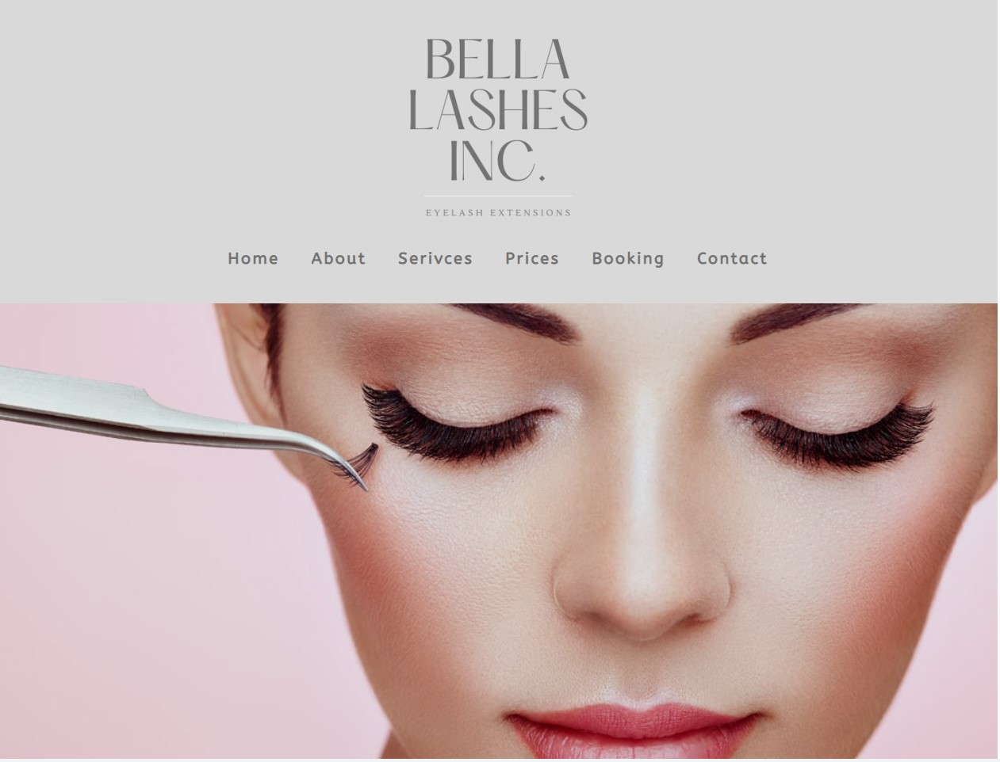

<h2 align="center">
Bella Lashes Inc. Web Application  
</h2>

## Built With

Bella Lashes Inc. was built using these technologies:

- React.js
- Sass
- React-Router
- React-Icons
- Mongoose
- MongoDB
- React-Calendar
- React-Modal

## 🛠 Installation and Setup Instructions

1. Installation: `npm install`

2. In the project directory, you can run: `npm start`

Runs the app in the development mode.\
Open [http://localhost:3000](http://localhost:3000) to view it in the browser.
The page will reload if you make edits.

## Deployment 

